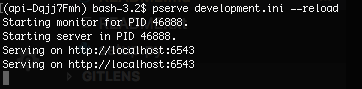
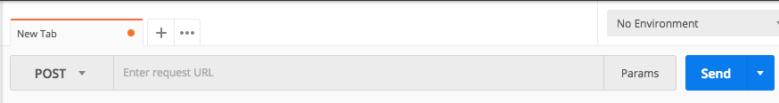
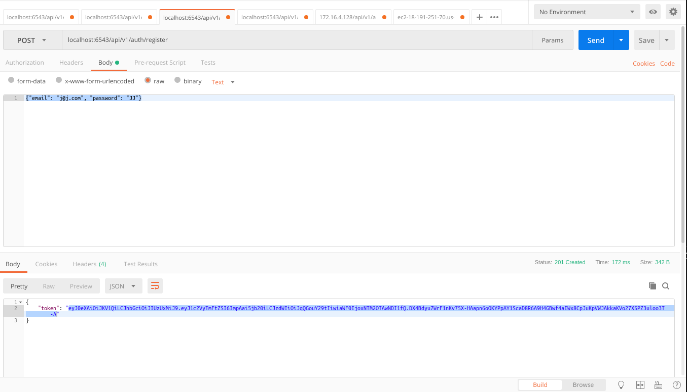
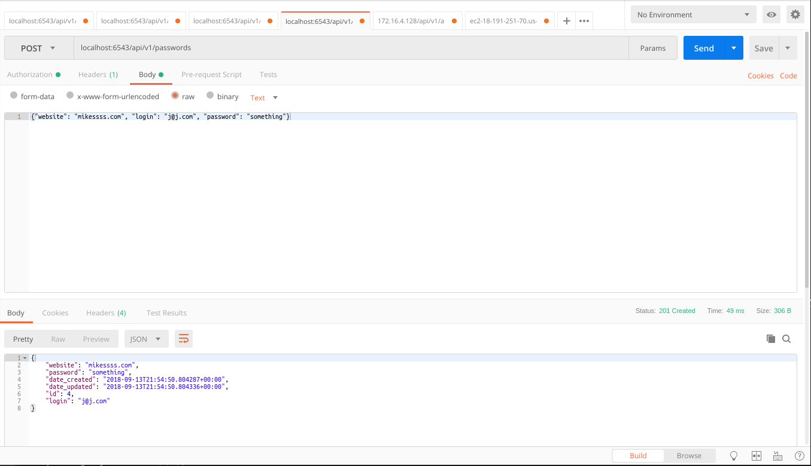
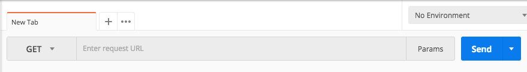
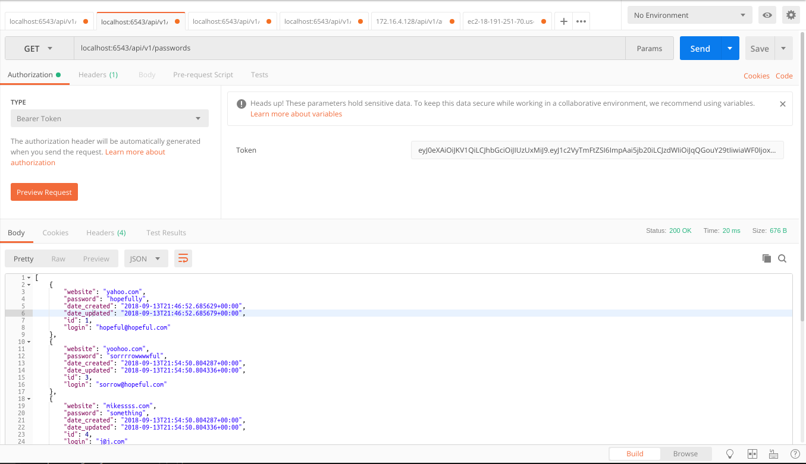
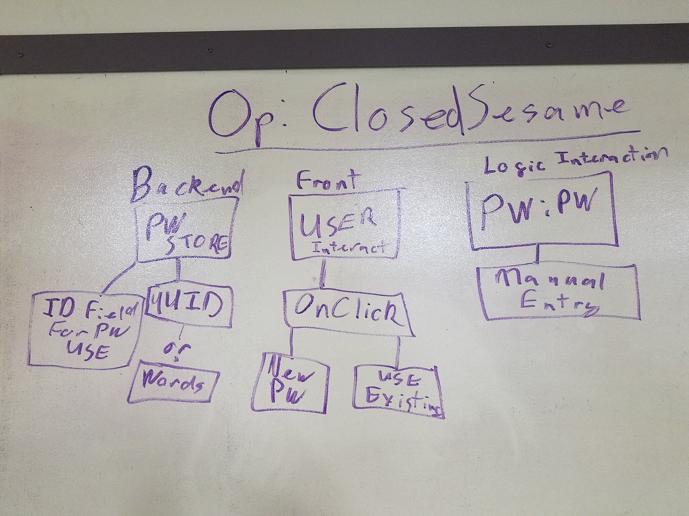

# ClosedSesame Readme

## Deployed Link
https://ec2-18-191-251-70.us-east-2.compute.amazonaws.com

## Authors
Nick Damberg, J Christie, Michael Sklepowich, Steph Harper

## Overview
ClosedSesame is your password manager. Our name is inspired by Open Sesame. But our philosophy is you have your password and you don't want it to be given to just anybody. And if you don't like having to remember your password, we will do that for you! And correspond it with the correct site. We do it for you automatically. You can also have multiple passwords for multiple sites.

## Installation Instructions
To run ClosedSesame locally, follow these steps:
1. Download Postman found [here](https://www.getpostman.com/apps).

2. After you've downloaded postman, download VS Code found [here](https://code.visualstudio.com/)

3. Once VS Code is downloaded, install pip. This will allow you to download all dependencies.

4. Once you have pip downloaded, fork this [repo](https://github.com/closedsesame). And clone the repo through git via your terminal or bash.

5. Stay in terminal and move into your cloned repo's folder. Create a pipenv file by typing this in, "pipenv shell". This makes sure the python version you're using stays consistent. Ex: I could be running 3.6 while you're running 3.7. The Pipfile says 3.6. This'll make sure everyone using this file will stay at 3.6.

6. Type this line in to gather all dependencies:
"pip install -e ".[testing]"

7. This application requires a server so to get that started, type this
into your terminal to turn it on: "pserve development.ini --reload". Here is what you should see:



8. Once you see the server running like the image above, open up a different terminal window. Do not close the server in your original terminal window.

9. Now you're ready!

## Step by Step Walkthrough
1. Open Postman application

2. To register a user, have an email and password ready. Click on the GET to the left of the 'request URL' bar, under the tab and change it to POST:


3. Click on Body tab. The default is set to form-data. Change this to 'raw'. Here's an example of what it should look like:


4. Enter in the request URL bar this: localhost:6543/api/v1/register
This will register your email and password. Now click the blue Send button in the right hand corner. You will receive a JWT or json web token in the lower Body tab. Copy-paste this into the Token field under the blue Send button for the following steps.

5. Once posted, you are now registered in the database. Open a new tab by clicking on the + sign to the right of your current tab. And now type into the request url: localhost:6543/api/v1/passwords

This is for your website passwords.

6. Make sure this is also set to POST. This takes three parameters: website, login and password. Once you click send, it should populate downbelow in the lower Body tab.


7. To see the whole list of which websites and passwords are connected to your account, keep the request url the same as step 6. But change the POST into a GET:


8. Click Send and you should see the results in the lower Body tab. Example image below:


## Database Schema


## License
ClosedSesame is under the MIT license.

## Change log
### Sep 12, 2018
- setup database
```
sudo -u postgres psql
\du
ALTER USER postgres WITH PASSWORD 'Password!1';
CREATE DATABASE closedsesame;
\l
\c closedsesame
\dt
```

-initalize DB
```
pip3 install -e ".[testing]"
initialize_api_db development.ini
#or
initialize_api_db production.ini
```

- gunicorn
```
sudo systemctl restart gunicorn
sudo systemctl status gunicorn
```

### Sep 12, 2018
- setup database
```
sudo -u postgres psql
\du
ALTER USER postgres WITH PASSWORD 'Password!1';
CREATE DATABASE closedsesame;
\l
\c closedsesame
\dt
```

-initalize DB
```
initialize_api_db development.ini
```

### Sep 05, 2018
- Updated apps features checklist

### Aug 29, 2018
- Created Repo

### Aug 30, 2018
- Initial Readme
